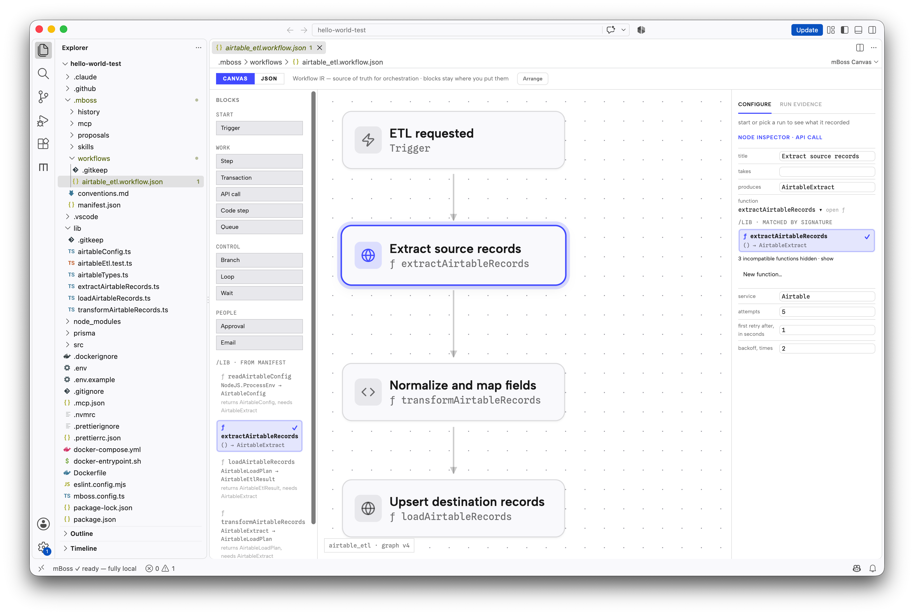

# mBoss

Design durable apps with [DBOS](https://www.dbos.dev) on a canvas, let a coding
agent help build them, and watch every run on your own machine.

A workflow in mBoss is a drawing: triggers, steps, branches, queues, waits and
approvals wired together. Save it and mBoss generates the durable DBOS
TypeScript behind it. You write the handlers as ordinary typed functions in
`lib/`; mBoss owns the plumbing in `src/workflows/`. Runs are recorded in the
project's Postgres, so a crash picks up where it stopped, and you can open any
run to see what each block did.

## Features

### The workflow canvas

Every `.mboss/workflows/*.workflow.json` opens in the **mBoss Canvas**.

- Drag blocks from the palette: **Trigger**, **Step**, **Transaction**,
  **API call**, **Code step**, **Queue**, **Branch**, **Loop**, **Wait**,
  **Approval** and **Email**.
- Wire blocks together, or drop a block onto a wire to splice it in.
- Set what a block does in the inspector.
- **Arrange** lays the whole drawing out again.
- Edits go through VS Code's own undo, dirty state and save, and a JSON tab
  shows the document itself.

Saving a workflow regenerates its code. Anything wrong with a workflow, such as
a transaction that calls out to the network, lands in the **Problems** panel.

### Start from a pattern

**mBoss: New Workflow…** opens a gallery of working patterns, each with its
handlers already in `lib/`:

| Pattern                       | What it shows                                                    |
| ----------------------------- | ---------------------------------------------------------------- |
| Checkout                      | Reserve, charge, fulfill — completed steps never run twice.      |
| Refund approval               | Policy decides the safe ones; people decide the rest.            |
| Reliable webhook              | Ingest a Stripe or GitHub event once; apply it in a transaction. |
| Human approval                | Agent output held durably until a person signs off.              |
| Deep research                 | Search, judge the evidence, loop until it's enough, report.      |
| Document ingestion            | Parse an upload, fan out work per page, finalize once.           |
| Document ingestion on a queue | Every page of an upload as its own run, held by a queue.         |
| Deployment                    | Build, approve, deploy, watch the rollout, roll back.            |
| Scheduled operations          | Cron-style durable jobs over your own functions.                 |

### A coding agent that proposes, not overwrites

The **Agent** view in the mBoss sidebar runs a coding agent inside your project
over the [Agent Client Protocol](https://agentclientprotocol.com):

- **Claude Code**
- **Codex CLI**
- **Gemini CLI**
- any other program that speaks the Agent Client Protocol

The agent works through the mBoss MCP server and Agent Skill that every mBoss
project carries. When it wants to change a workflow, the change appears on the
canvas as a preview. Nothing is written until you choose **Apply proposal**, and
an applied change can be undone.

### Runs, on your machine

The **Runs** view lists the project's DBOS runs, read straight from its local
Postgres. Filter by failed or recovered runs, and start or stop the local stack
from the view's title bar.

- **Run Workflow…** starts a workflow with the input you give it. The request
  goes to the app on `localhost:3000`; nothing leaves your machine.
- Open a run to see its timeline and every step it recorded. The canvas shows
  where a run has got to, and the inspector shows what each block recorded.
- **Cancel** a run, **resume** one, or **rerun** it with the same input.
- **Replay from here** forks a run from a recorded step. Earlier steps are
  reused, later ones execute again.
- **Ask agent why** hands the run's recorded evidence to your coding agent.

If the app is deployed with DBOS Conductor, set `mboss.conductor.consoleUrl` to
open its console from the Runs view.

## Requirements

- **VS Code 1.120** or later.
- **Node.js 24** and npm. Projects target Node 24, and Claude Code and Codex are
  started through `npx`.
- **Docker** with Compose v2. The local stack is Postgres 17 and your app, on
  ports `5432` (loopback only) and `3000`.
- The coding agent you choose, installed and signed in. Gemini CLI must be on
  your `PATH`.

## Getting started

1. Run **mBoss: New Project** from the Command Palette. Choose a parent folder
   and a name; mBoss creates the project and opens it.
2. In the project's terminal, run `npm install`.
3. Run **mBoss: New Workflow…** and pick a pattern, or open a workflow under
   `.mboss/workflows/`.
4. Start the stack with **mBoss: Start Local Stack**, or the play button in the
   Runs view.
5. Run **mBoss: Run Workflow…**, then open the run from the Runs view.

To bring in an agent, open the mBoss sidebar and use **Choose** in the Agent
view.

Each project's own `README.md` explains its layout and how to deploy it.

## Commands

| Command                     | What it does                                       |
| --------------------------- | -------------------------------------------------- |
| mBoss: New Project          | Create an mBoss project and open it.               |
| mBoss: New Workflow…        | Start a workflow from the pattern gallery.         |
| mBoss: Generate Code        | Regenerate the project's code now, without a save. |
| mBoss: Arrange Workflow     | Lay out the open workflow again.                   |
| mBoss: Open Agent Sidebar   | Show the Agent view.                               |
| mBoss: Choose Coding Agent… | Pick which agent the sidebar starts.               |
| mBoss: Start Local Stack    | Build and start Postgres and the app with Docker.  |
| mBoss: Stop Local Stack     | Stop them.                                         |
| mBoss: Run Workflow…        | Start a workflow run with an input.                |
| mBoss: Open Runs            | Show the Runs view.                                |

## Settings

| Setting                      | Default | Description                                                                         |
| ---------------------------- | ------- | ----------------------------------------------------------------------------------- |
| `mboss.agent.id`             | —       | `claude-code`, `codex`, `gemini` or `custom`. Set it with **Choose Coding Agent…**. |
| `mboss.agent.command`        | `""`    | The program to start when the agent is `custom`.                                    |
| `mboss.agent.args`           | `[]`    | Arguments for the custom agent, passed exactly as written.                          |
| `mboss.conductor.consoleUrl` | `""`    | Your DBOS Conductor console, opened from the Runs view.                             |

## Workspace trust

In a restricted window you can view and edit workflows. Creating projects and
workflows, generating code, running a coding agent, reading run history and
starting the local stack all write to, run or connect to things the folder
supplies, so they wait until you trust the folder.

## License

[MIT](LICENSE). Bundled third-party software is listed in
[THIRD_PARTY_NOTICES.md](THIRD_PARTY_NOTICES.md).
